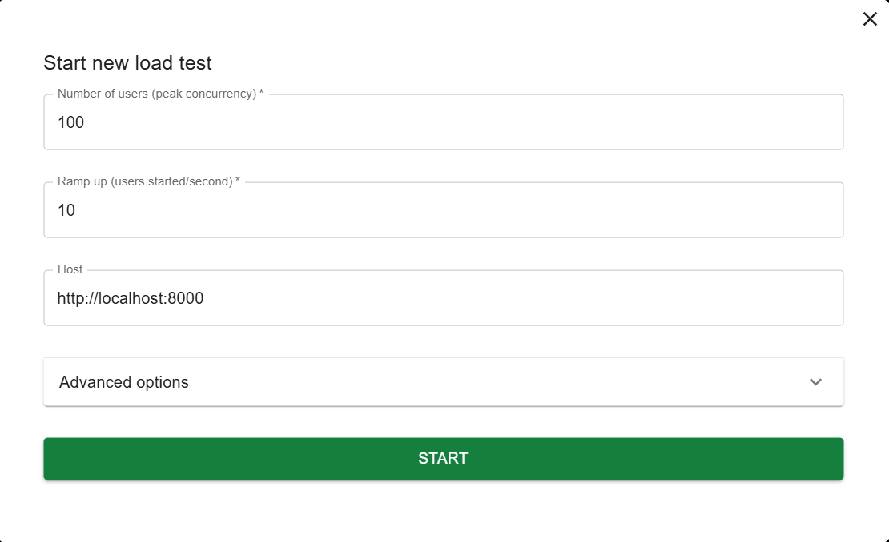
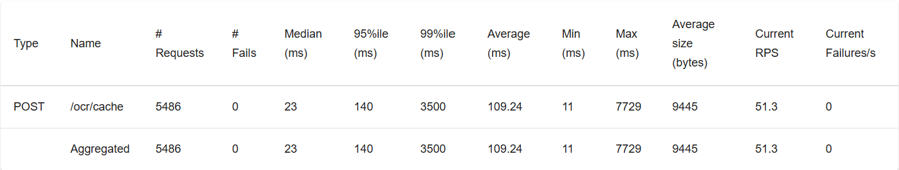

### 1. Number of users (peak concurrency)
- Locust sẽ tạo ra 100 người dùng ảo để đồng thời gửi yêu cầu đến hệ thống, mô phỏng 100 người dùng thực tế truy cập cùng lúc (peak concurrency)
### 2. Ramp up (users started/second)
- Locust sẽ tăng dần số lượng người dùng ảo với tốc độ 10 người dùng mỗi giây, cho đến khi đạt được 100 người dùng (mất 100/10 = 10 giây để đạt mức tối đa).

### 1. Type 
- Loại yêu cầu HTTP được gửi. Ở đây là POST, nghĩa là bạn đang kiểm tra một endpoint nhận yêu cầu POST.
### 2. Name 
- Đường dẫn hoặc tên của endpoint được kiểm tra. Ở đây là /ocr/cache, nghĩa là yêu cầu được gửi đến endpoint này.
### 3. Requests 
- Số lượng yêu cầu đã được gửi. Ở đây là 5486 yêu cầu.
### 4. Fails 
- Số lượng yêu cầu thất bại. Ở đây là 0, nghĩa là không có yêu cầu nào thất bại – hệ thống hoạt động ổn định.
### 5. Median (ms) 
- Thời gian phản hồi trung vị (median response time), tính bằng mili giây (ms). Ở đây là 23ms, tức là 50% yêu cầu được xử lý nhanh hơn hoặc bằng 23ms.
### 6. 95%ile (ms) 
- Thời gian phản hồi tại bách phân vị 95 (95th percentile). Ở đây là 140ms, nghĩa là 95% yêu cầu được xử lý trong 140ms hoặc nhanh hơn.
### 7. 99%ile (ms) 
- Thời gian phản hồi tại bách phân vị 99 (99th percentile). Ở đây là 3500ms, nghĩa là 99% yêu cầu được xử lý trong 3500ms hoặc nhanh hơn. Giá trị này khá cao, cho thấy có một số ít yêu cầu (1%) bị xử lý rất chậm.
### 8. Average (ms) 
- Thời gian phản hồi trung bình. Ở đây là 109.24ms, tức là trung bình mỗi yêu cầu mất 109.24ms để hoàn thành.
### 9. Min (ms) 
- Thời gian phản hồi ngắn nhất. Ở đây là 11ms, nghĩa là yêu cầu nhanh nhất được xử lý trong 11ms.
### 10. Max (ms)
- Thời gian phản hồi dài nhất. Ở đây là 7729ms, nghĩa là có một yêu cầu mất tới 7729ms (gần 8 giây) để hoàn thành – điều này có thể chỉ ra một số vấn đề về hiệu suất hoặc nghẽn cổ chai.
## 11. Average size (bytes)
- Kích thước trung bình của phản hồi (response), tính bằng byte. Ở đây là 9445 bytes, tức là mỗi phản hồi trung bình có kích thước khoảng 9.4KB.
### 12. Current RPS
- Tốc độ yêu cầu mỗi giây (Requests Per Second) tại thời điểm hiện tại. Ở đây là 51.3, nghĩa là hệ thống đang xử lý 51.3 yêu cầu mỗi giây.
### 13. Current Failures/s
- Tốc độ thất bại mỗi giây (Failures Per Second) tại thời điểm hiện tại. Ở đây là 0, nghĩa là không có thất bại nào xảy ra tại thời điểm này.